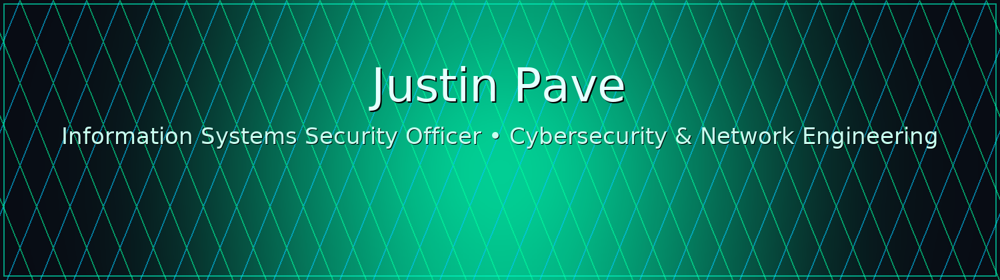

<!-- Banner -->

  

  <a href="https://www.linkedin.com/in/justinpave/">LinkedIn</a> •
  <a href="mailto:justin.pave@gmail.com">Email</a>

---

### 👋 Hi, I’m Justin

I’m an **Information Systems Security Officer (ISSO)** and **U.S. Army veteran** with 20+ years in **cybersecurity, IT systems, and network engineering**. I support **DoD and federal agencies**, keeping mission-critical systems secure, compliant, and reliable — and I love tinkering in a homelab to stay sharp and curious.

---

  

### 🔧 Core Skills
- 🔐 **Cyber & Risk:** RMF, NIST, CMMC, FedRAMP • eMASS/Xacta • POA&Ms • ACAS
- 🌐 **Networks & Infrastructure:** pfSense, Cisco • Red Hat & Windows • VMware ESXi/ vSphere • TrueNAS
- 📊 **SecOps & SIEM:** Splunk, LogRhythm, Security Onion • Log analysis & continuous monitoring
- ☁️ **Virtualization & Cloud:** VMware, Proxmox, Hyper-V
- ⚙️ **Automation:** PowerShell, Bash, Python

### 🧪 In My Homelab
- **pfSense** firewall + DNS filtering, rulesets, and dashboards  
- **Security Onion** for SIEM, detections, and log pipelines  
- **Automation** for vuln scans and reporting (PowerShell)  
- **Virtualization playground** on Proxmox for repeatable lab builds

### 📂 What You’ll Find Here
- Practical **lab guides**, **configs**, and **scripts** (no sensitive data)  
- Small utilities that make admin and security work easier  
- Ongoing experiments in **DevSecOps** and **cloud security**

### 📌 Featured Repos (pin these)
- `pfsense-lab` — Configs, DNSBL, and rulesets for a secure home gateway  
- `security-onion-playbook` — Quickstart + tuning notes for a home SOC  
- `windows-admin-scripts` — PowerShell utilities for everyday IT tasks  
- `aws-compliance-checks` — Simple checks against security baselines

### 🎓 Certifications
**CASP+**, **CySA+**, **Security+**, **Agile Scrum Master**, **Lean Six Sigma Yellow Belt**  
Active **TS/SCI** clearance

---

  <i>I enjoy mentoring, collaborating, and continuously improving security operations. If any of my projects help you, drop a star or say hello!</i>

